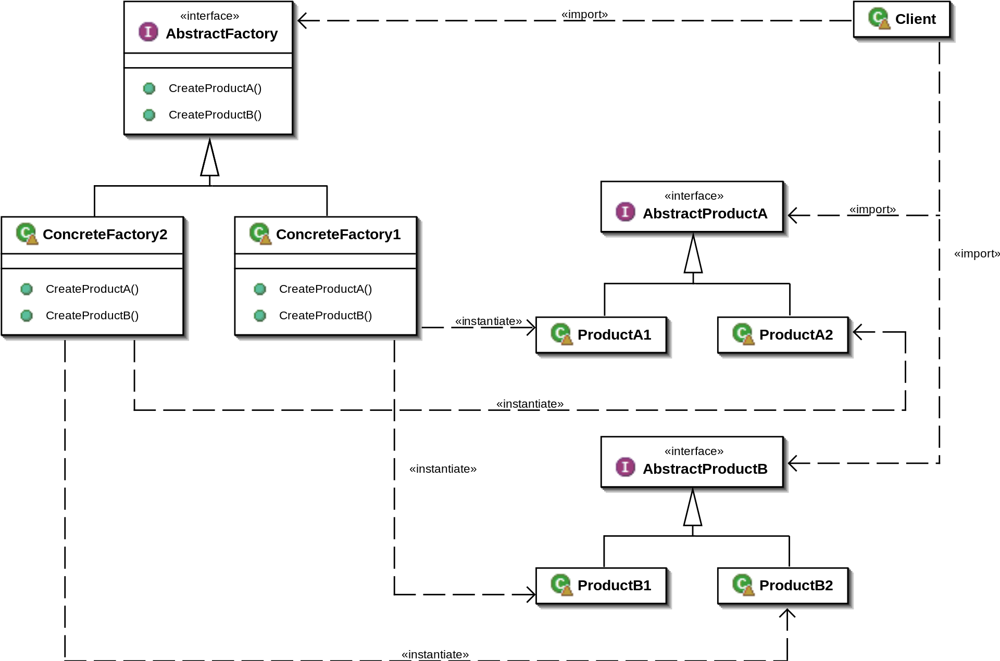

# Design patterns
In deze sessie gaan we een oefening maken ivm met abstract factory pattern & decorator (indien er nog tijd is).

## Waarvoor gebruiken abstract factory pattern?
Encapsuleren van individuele factories, die dezelfde groep van objecten aanmaken (een familie), zonder hun concrete klasse te specificeren.
Maw, we zijn niet geïnteresseerd in welk object van deze familie wordt aangemaakt, de afhandeling gebeurt in de de abstract factory.

## Welke problemen lost dit op?
* Hoe kan een applicatie onafhankelijk zijn van hoe zijn objecten zijn gecreëerd?
* Hoe kan een klasse onafhankelijk zijn van de creatie van de objecten dat deze klasse nodig heeft?
* Hoe kan een 'familie' van gerelateerde of afhankelijke objecten gecreëerd worden?

## diagram

## Exercise
[abstract factory pattern](AbstractFactoryPattern.md)